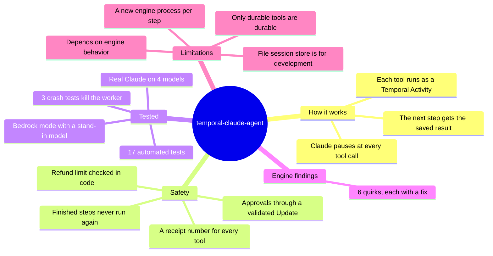
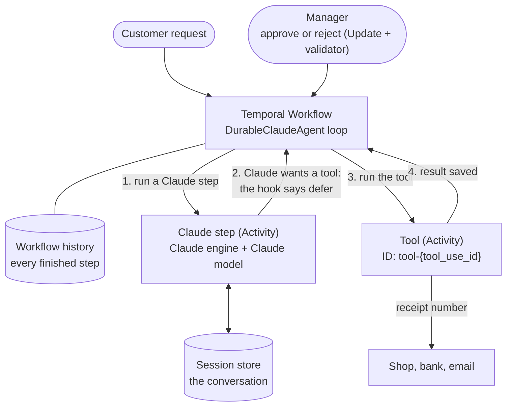
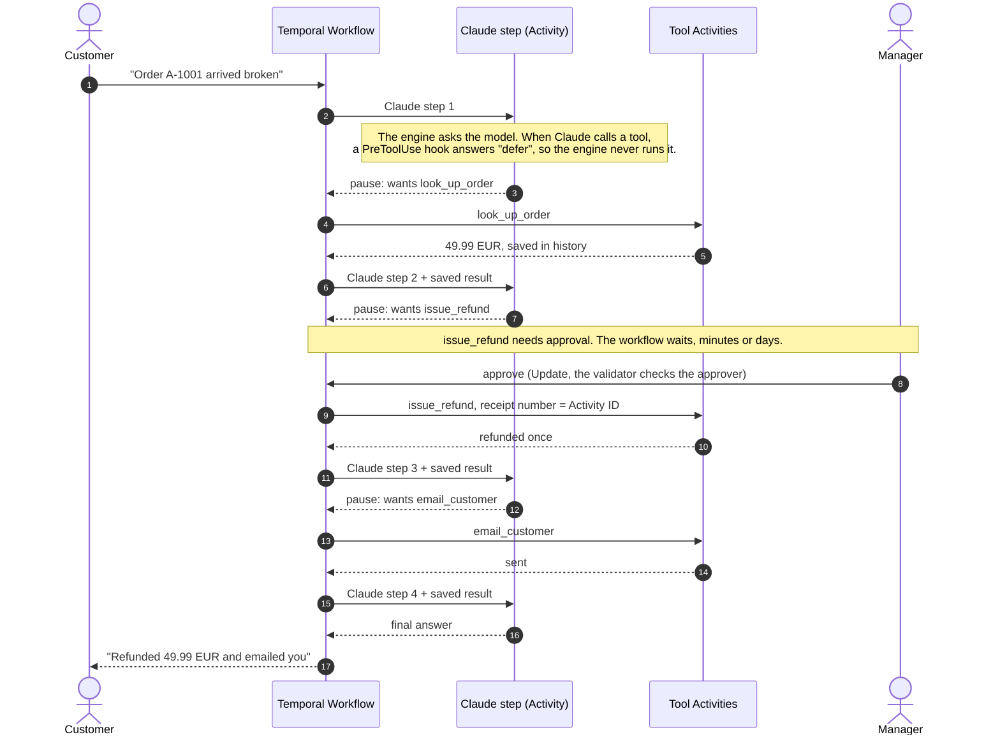
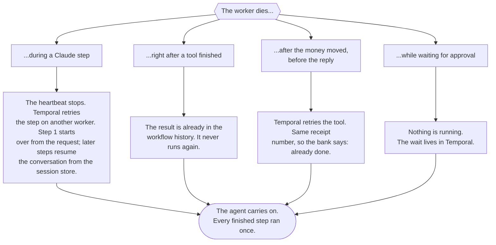
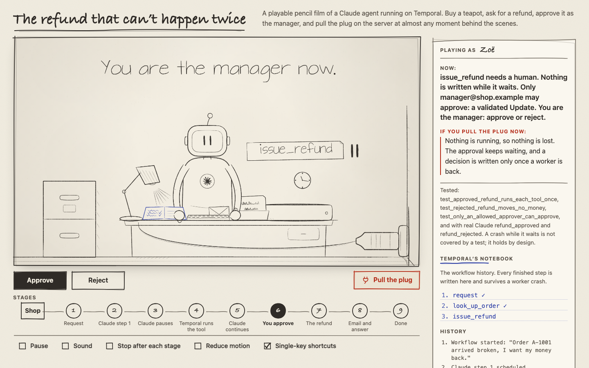
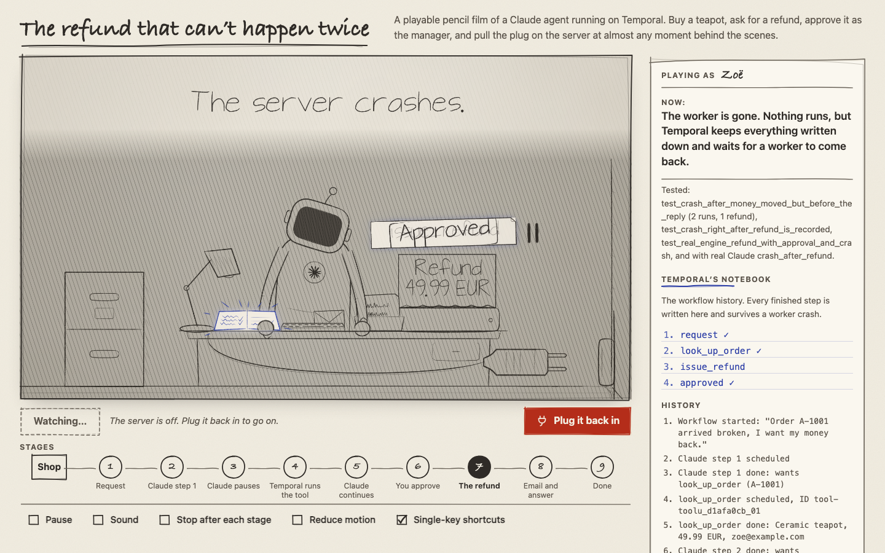

# temporal-claude-agent

Crash-proof Claude agents on Temporal.

Agents built with Anthropic's Claude Agent SDK lose their place when a machine crashes, and
they can repeat risky actions. This package runs the agent loop inside a Temporal Workflow:

- every durable tool call is its own Temporal Activity: recorded, retried, never run again once finished
- a crash resumes from the last finished step, on any worker
- risky tools wait for a human approval, for minutes or for days
- progress and cost are visible (Queries, and clear Activity names in the Temporal UI)

**Status: v0.1, a tested prototype.** 17 automated tests, including worker crashes (SIGKILL) and
the real Claude Code engine running on Temporal with a stand-in model. Real Claude test matrix
(8 scenarios, 2 runs each): passed on Sonnet 5, Opus 5.5 and Fable 5.1 (16 of 16 each) and on
Haiku 4.5. Read the limitations below before using it for anything real.

This is a community project. It is not an official Temporal or Anthropic integration.

## At a glance



## How it works

1. Durable tools are declared to Claude. A PreToolUse hook answers "defer", so Claude stops at each
   tool call. The Claude engine never runs the tool itself.
2. The Workflow runs the tool as its own Temporal Activity (ID `tool-<tool_use_id>`), after a
   human approval if the tool needs one.
3. The next Claude step resumes the session from a session store and receives the saved result as
   a normal `tool_result`. Claude continues, and can pause again at the next tool.



Why it is built this way (the engine behaviors we found, and the workaround for each):
[`spike/FINDINGS.md`](spike/FINDINGS.md).

## One refund, step by step



4 Claude steps, 3 tool Activities, 1 human approval. Every step lands in Temporal's history.

## What if the machine dies?



The first three are tested by killing the worker with SIGKILL:
`test_crash_in_the_middle_of_a_claude_segment`, `test_crash_right_after_refund_is_recorded` and
`test_crash_after_money_moved_but_before_the_reply`. The approval wait is Temporal's own design:
nothing runs while it waits.

## See it interactively

<p>
  <a href="https://osamastro7-droid.github.io/temporal-claude-agent/map/"></a>
  <a href="https://osamastro7-droid.github.io/temporal-claude-agent/map/"></a>
</p>

Open the [interactive map](https://osamastro7-droid.github.io/temporal-claude-agent/map/), a playable pencil film: type your name, buy the
teapot, ask for a refund, approve it as the manager, and pull the plug at almost any moment to see how the agent recovers.

## Quick look

```python
@workflow.defn
class RefundAgentWorkflow:
    def __init__(self) -> None:
        self.agent = DurableClaudeAgent(
            system_prompt="You handle refund requests for an online store.",
            tools=[durable_tool(look_up_order),
                   durable_tool(issue_refund, needs_approval=True),
                   durable_tool(email_customer)],
            approvers=["manager@shop.example"],
        )

    @workflow.run
    async def run(self, request: str) -> str:
        return await self.agent.run(request)

    @workflow.update
    def review(self, tool_use_id: str, approved: bool, approver: str) -> str:
        self.agent.decide(tool_use_id, approved, approver)
        return "approved" if approved else "rejected"

    @review.validator
    def check_review(self, tool_use_id: str, approved: bool, approver: str) -> None:
        self.agent.validate_decision(tool_use_id, approver)
```

Worker: `Worker(client, ..., plugins=[ClaudeAgentPlugin(runner)])`, where `runner` is
`ScriptedClaude(...)` for tests or `ClaudeAgentSdkRunner(session_store=...)` for real Claude.
The full demo is in [`examples/refund_agent`](examples/refund_agent).

## What "runs once" means

Temporal records every finished tool call and never runs it again, even if a worker dies later.
If a worker dies *while* a tool is running, Temporal retries that tool: Activities run at least
once. So every tool call gets a stable receipt number, its Activity ID (`tool-<tool_use_id>`), to
pass to the outside system as an idempotency key. The demo shop does exactly that, and a test
kills the worker after the money moved but before the reply: 2 attempts, 1 refund.

## Approvals

Approvals are a Temporal Update with a validator. An approval from someone who is not in
`approvers`, or for a call that is not waiting, is refused by the validator and never written to
the workflow history. Every decision records who made it (`decided_by` in the `tool_calls` Query).
The demo checks an email address; in production, connect this to your real identity system.

## Security

- **Approvals:** validated Update plus an allowed list (see above).
- **Validate tool input in code.** The model chooses tool arguments. The demo refund tool refuses
  any amount above the order total, whatever the model asks for.
- **Data at rest:** tool inputs and results are stored in Temporal's history, and the conversation
  in the session store. Encrypt payloads with a Temporal payload codec, and use an encrypted store.
- **Spending:** `max_budget_usd` caps each Claude step, and `max_segments` caps the number of steps.
  There is no workflow-wide budget yet.
- **Logins:** use `ANTHROPIC_API_KEY`, Amazon Bedrock or Google Vertex. A Claude subscription token
  (`claude setup-token`) is only for testing your own code; Anthropic does not allow products built
  on the Agent SDK to run on claude.ai subscription limits unless approved.
- **Isolation:** built-in Claude Code tools are off by default (`tools=[]`), and `setting_sources=[]`
  stops project or user settings and hooks from loading. The pause hook's settings file lives in a
  private temporary folder.
- **Supply chain:** the package depends on the closed Claude Code engine. Pin the versions you test.

## Limitations (v0.1)

1. **It depends on today's engine behavior.** Pausing uses the PreToolUse "defer" decision, which
   Anthropic documents ([hooks docs](https://code.claude.com/docs/en/hooks)). Resuming after several
   pauses in one session relies on engine behavior we tested, including quirks we work around. If a
   new engine stops honoring "defer", the agent fails closed: durable tools never run inside the
   engine, the step stops with an error that names the engine version, and a tool call never runs
   twice ([`tests/test_fail_closed.py`](tests/test_fail_closed.py)). CI runs the test matrix daily
   against the newest SDK and Claude Code (tested on engines 2.1.277, 2.1.280 and 2.1.281).
2. **Speed.** Each Claude step starts a new engine process: roughly 1 to 1.5 seconds of overhead
   per step, measured with a stand-in model. Parallel tool calls run one at a time, which costs an
   extra model turn. Model time usually dominates, but this is not built for high volume.
3. **Only durable tools are durable.** Built-in Claude Code tools (terminal, file edits, web search)
   are off by default. If you turn them on, they run inside the step: after a crash they can run
   again, and Temporal does not record them.
4. **The conversation lives outside Temporal.** `FileSessionStore` is for development. It passes
   the six required contracts of the Claude Agent SDK's own `run_session_store_conformance` suite
   ([`tests/test_session_store.py`](tests/test_session_store.py)). Production needs a shared, durable
   store: the runner accepts any SDK `SessionStore` (only `append` and `load` are required), and
   Anthropic's SDK repo has reference S3, Redis and Postgres adapters in
   [`examples/session_stores`](https://github.com/anthropics/claude-agent-sdk-python/tree/main/examples/session_stores)
   (Anthropic calls them reference code, not production code). Every worker must use the same
   working folder (`cwd`), because the session key includes it.
5. **Very long agents.** Continue-As-New is not implemented yet. Measured with the real agent loop
   on Temporal Server 1.32 defaults: each tool call adds 12 events and about 3.2 KiB of history, and
   each tool result is stored twice (as the tool's output and as the next Claude step's input).
   Temporal suggests Continue-As-New at 4,096 events or 4 MiB: this demo agent reaches it at tool
   call 342, or after about 41 tool calls with 50 KB results. With small results, the default
   `max_segments=50` keeps a run well below that. Keep large tool results out of payloads (store a
   reference instead): by default Temporal rejects any single payload over 2 MiB.
6. **Test scope.** One demo domain, 8 scenarios, 2 runs per model. Real agents have more tools,
   longer conversations and messier data.
7. **When not to use it.** For simple tool-calling agents, calling the Claude API directly from
   Temporal Activities is simpler and faster. This package is for teams who want the Agent SDK
   (Claude Code's agent loop, context management, subagents, MCP, skills) and durability.

## Logins for durable agents

Use a login from the environment: `ANTHROPIC_API_KEY`, Amazon Bedrock or Google Vertex. A Claude
app login cannot renew itself when a paused session resumes (the SDK removes the refresh token on
purpose), so long-running agents would fail with "OAuth session expired". The runner warns when no
environment login is set. To use a newer engine than the one inside the SDK, set `CLAUDE_CLI_PATH`.

## Run the demo

```bash
git clone https://github.com/osamastro7-droid/temporal-claude-agent && cd temporal-claude-agent
pip install -e ".[dev]"
temporal server start-dev                          # window 1
cd examples && python -m refund_agent.worker       # window 2
cd examples && python -m refund_agent.run_demo     # window 3
```

## Tests

```bash
pytest -v                                  # 17 tests; needs the `temporal` CLI on PATH
python -m spike.real_matrix --mock         # 8 scenarios on the real engine, stand-in model
python -m spike.real_matrix --mock-bedrock # the same with the engine in Amazon Bedrock mode
```

GitHub Actions runs all of this on every push, and every day against the newest SDK and the newest
Claude Code release, to catch engine changes early. Testing with real Claude:
[`docs/testing-with-real-claude.md`](docs/testing-with-real-claude.md).

## License

MIT. Built by Osamah Al-Harazi.
